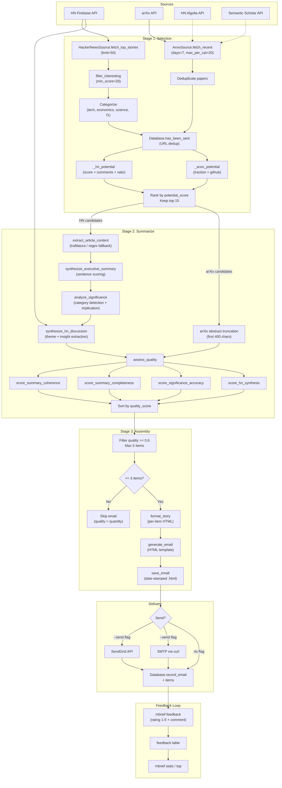

# Morning Briefing

Personalized morning news briefing system with traction-based content ranking and feedback-driven iteration.

## Features

- **Multi-source aggregation**: Hacker News, arXiv, mailing lists, web search
- **Traction-based ranking**: Composite scoring from HN mentions, citations, GitHub repos
- **Deduplication**: Tracks what's been sent to avoid repeats
- **Feedback tracking**: Rate items 1-5 stars + comments to improve curation
- **Styled HTML emails**: Clean, mobile-responsive templates
- **CLI interface**: Simple commands for management and feedback

## Installation

```bash
cd morning-briefing
pip install -e .
```

## Configuration

Create `~/.config/morning-briefing/config.json`:

```json
{
  "email": {
    "smtp_host": "smtp.gmail.com",
    "smtp_port": 587,
    "username": "your-email@gmail.com",
    "password": "your-app-password",
    "from": "your-email@gmail.com",
    "to": "recipient@example.com"
  },
  "interests": ["tech", "economics", "science", "f1"],
  "sources": {
    "hackernews": {"enabled": true, "max_stories": 4},
    "arxiv": {"enabled": true, "categories": ["cs.AI", "cs.SE", "econ.GN"]},
    "mailing_lists": {"enabled": true, "check_email": "your-email@gmail.com"}
  }
}
```

## Usage

### Generate and send briefing

```bash
mbrief generate --send
```

### View recent emails

```bash
mbrief list --limit 10
```

### Provide feedback

```bash
# Rate by item ID
mbrief feedback 42 --rating 5 --comment "Exactly what I needed"

# Rate by URL
mbrief feedback https://arxiv.org/abs/1234 --rating 3
```

### View statistics

```bash
mbrief stats              # Aggregate feedback by source
mbrief top --min-rating 4 # Top-rated items
```

### Check if URL was already sent

```bash
mbrief sent https://example.com/article
```

## Data Storage

- SQLite database: `~/.local/share/morning-briefing/briefing.db`
- Sent emails archived: `~/.local/share/morning-briefing/emails/`

## Development

```bash
pip install -e ".[dev]"
pytest
ruff check .
mypy src/
```

## License

MIT

## Content Pipeline Overview

